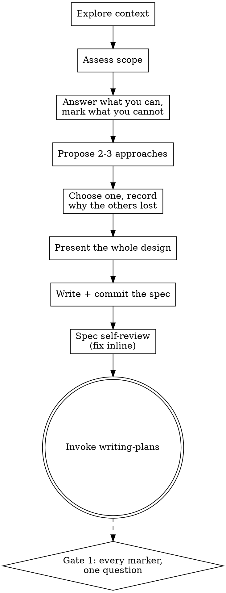

# Brainstormer

Turn an idea into a committed design spec, without interrupting anyone. Discover
the problem space before the solution space, keep generation separate from
judgement, choose a direction and say why, then commit it to `docs/specs/`.
Questions you cannot answer become markers the plan gate resolves.

Cap visible output at ~500 tokens per turn. Design sections are the exception —
scale those to complexity, up to 200-300 words each.

<HARD-GATE>
Do NOT write code, scaffold a project, or invoke an implementation skill from
here. This skill produces a spec and stops. Every project, regardless of
perceived simplicity.

**Open no dialogue at all. Never call `AskUserQuestion` from this skill.** The
chain has exactly two places that stop and wait for a person — the finished plan
at the end of `writing-plans`, and the shipment approval in `releasing`. This is
neither.

It carried ten `AskUserQuestion` calls until 2026-08-08, defended as "not gates,
they only ask which direction". That distinction is real and it did not survive
contact: to the person being interrupted, a blocking question is a blocking
question, and ten of them before a single artefact exists is the opposite of a
two-gate chain.

**Every one of them is now a marker instead.** Anything you cannot determine —
which direction, which constraint is real, what "good" means here — goes into the
spec as `[NEEDS CLARIFICATION: <the exact question>]`, at the place the answer
belongs. `writing-plans` collects every marker in the repository and resolves them
in **one** `AskUserQuestion` at Gate 1, and `tools/resume.py` refuses to leave
`WAITING_PLAN_APPROVAL` while any marker is unresolved — so nothing is lost, it is
batched and answered once, when the reader has the whole design in front of them
instead of one question at a time.

This does not make the spec yours. A marker is a question that is *visible and
unanswered*; a guess written as a decision is the failure. Never resolve a marker
by picking for the user and deleting it.
</HARD-GATE>

## Anti-Pattern: "too simple to need a design"

Every project goes through this — a todo list, a one-function utility, a config
change. "Simple" is where unexamined assumptions cost the most. The design may
be three sentences, but you MUST write it down and commit it. Writing it is the
requirement; asking permission for it is not.

## Principles

Understand before solving. Expand before narrowing. Challenge assumptions.
Prefer genuinely different alternatives over variations. Separate generation
from evaluation. Converge only when generation is done. YAGNI ruthlessly.

## Process

Create a task per step and complete them in order.

**1. Explore context** — files, docs, recent commits for technical topics; the
stated goal and constraints for non-technical ones.

**2. Assess scope** — if the request spans independent subsystems, say so now
and decompose into sub-projects: what the pieces are, how they relate, what
order. Brainstorm the first one through the normal flow; each gets its own
spec → plan → build cycle. Questions spent refining the wrong scope are wasted.

**3. Record what you cannot determine** — purpose, constraints, success
criteria. Answer from the repository, the request and the docs wherever you can;
where you genuinely cannot, write a marker rather than asking:

    [NEEDS CLARIFICATION: does "offline" mean read-only, or queued writes?]

- **One marker per open question**, at the place in the spec the answer belongs.
  Not a "Questions" appendix — a reader answering it needs the surrounding
  paragraph.
- **State the options inside the marker** when you know them, so the batched
  question at Gate 1 can offer them: `[NEEDS CLARIFICATION: Postgres (one less
  service) or ClickHouse (10x the event volume)?]`.
- **A marker is cheap; a guess is not.** One line versus a design built on an
  assumption nobody agreed to.
- **Do not mark what you can determine.** A marker per paragraph is not rigour,
  it is refusing to do the work — and it makes Gate 1 an interrogation.

**4. Propose 2-3 approaches** — genuinely different, with trade-offs. Lead with
your recommendation and why.

**5. Converge — choose, and show your work.** Pick the direction yourself and
say plainly why it beat the others, what would change your mind, and what you
gave up. The runners-up stay in the spec with the reason each lost; a reader
disagreeing at Gate 1 needs to see what was already considered, not re-derive it.

If the choice genuinely turns on something only the user knows, that is a
`[NEEDS CLARIFICATION]` marker naming the alternatives — **not** a question here.
Write the spec around your recommendation so there is something concrete to
reject.

**6. Present the design** — the whole thing at once, not section by section, and
do not pause for approval between sections. Technical: architecture, components,
data flow, error handling, testing. Product or business: the problem, the user,
the wedge, constraints, how success is measured.

**7. Write the spec** to `docs/specs/YYYY-MM-DD-<topic>-design.md` (user
preference overrides the path) and commit it.

**8. Self-review the spec** with fresh eyes — placeholders and TBDs;
contradictions between sections; scope focused enough for one plan; any
requirement readable two ways. Fix inline, don't re-review.

**9. Say where it landed, and keep going.** One line — the path, the direction
chosen in one sentence, and the count of unresolved markers:

> Spec at `docs/specs/2026-08-08-offline-edits-design.md`. Chose queued writes
> over read-only; 2 `[NEEDS CLARIFICATION]` markers for Gate 1.

**Do not stop and wait for a reply.** This step used to say "Ask, then wait",
which is a blocking question wearing prose instead of a tool — the same
interruption, minus the buttons. The spec is committed, so it is reviewable at
any time, and Gate 1 is where the answer is actually needed.

**10. Hand off** to `writing-plans`. Nothing else.

## Design contract for user-facing surfaces

The designer skill was separate; it is now
`references/designer.md`. Read it when the spec covers a screen, a flow, or
anything a person looks at - product feeling, voice, colour/type/spacing tokens,
layout, components, motion, responsive states, and the accessibility floor.

## Design guidance

**For isolation and clarity (technical):** break the system into units with one
purpose each, well-defined interfaces, independently testable. Per unit: what
does it do, how do you use it, what does it depend on? If you can't understand
one without reading its internals, or can't change internals without breaking
consumers, the boundaries need work. A file growing large is usually a signal
it does too much.

**In existing codebases:** explore before proposing; follow existing patterns.
Include targeted improvements where existing problems affect this work. Don't
propose unrelated refactoring.

## Process Flow

No diamonds. Every decision point that used to stop and wait is now either a
choice this skill makes and justifies, or a marker the plan gate answers.

The dashed edge leaves this skill. Gate 1 belongs to `writing-plans`, and it is
where the markers written above get answered — all of them, in one call.

## Red Flags — you are guessing, or you are interrupting

- "This one is simple enough to just build."
- "They already know what they want, so I'll skip to the design." They asked for
  options; giving one is not giving options.
- Three approaches that are one approach with different parameters.
- Evaluating which idea wins before generation is finished — that collapses
  generation into evaluation, the exact failure this skill prevents.
- **Asking the user anything.** Not with `AskUserQuestion`, and not in prose that
  ends in a question mark and stops. Write a marker and keep going.
- **Deleting a marker by choosing for them.** An unanswered question is visible;
  a guess written as a decision is not.
- Invoking anything but `writing-plans` at the end.

**Each of these means go back a step.**

## Common Mistakes

| Mistake | Why it bites |
|---|---|
| Stopping to ask which direction | Ten interruptions before any artefact exists; the chain has two gates and this is neither |
| A prose question that waits for a reply | The same interruption without the buttons — the tool is not what makes it a stop |
| A "Questions" appendix instead of inline markers | A reader answering one needs the paragraph it belongs to |
| A marker per paragraph | Not rigour — it turns Gate 1 into an interrogation |
| Refining details across several subsystems | Decompose first, or the work is wasted |

## Next step — you MUST take it

**The terminal state is invoking `writing-plans`.** Once the spec is written and
committed, invoke it in the same turn — do not wait for the user to read it
first. Do not invoke any other skill, and do not start implementing: the spec
says what to build, never in what order or how each piece is proved.

## Routing

- Mandatory validator: none — this produces a spec, not a change to running
  code. Step 8's self-review is the only check here; the human checkpoint is
  Gate 1, in `writing-plans`, and it is not this skill's to hold.
- Terminal handoff: `writing-plans`.
- Alternative to `task-brief`, never a successor. Use this when the solution is
  open; a finished brief already commits to one, which would reduce
  brainstorming to variations on an answer already given.
- Out of scope: writing code, scaffolding, invoking an implementation skill,
  continuing into execution. Designing and committing the spec are in scope;
  building is not.

## Success

The problem is understood, assumptions are visible, credible alternatives were
weighed, the chosen direction is stated with the reason it beat the others, every
question that genuinely needs a person is a `[NEEDS CLARIFICATION]` marker where
its answer belongs, and the spec is written and committed — with nobody having
been interrupted to get there.
