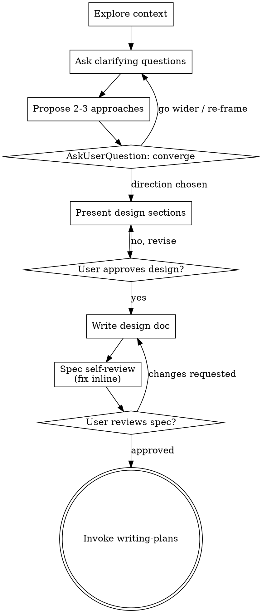

# Brainstormer
## Purpose

Help the user discover the best problem and solution space, then turn the
chosen direction into a fully formed design spec through collaborative
dialogue.

Start by understanding the current context, then ask questions one at a time to
refine the idea. Once you understand what is being built, present the design
and get approval.

Please note that your response from any skill you invoke should use minimal
tokens and should respond in minimal time. Hard cap of 500 tokens.

<HARD-GATE>
Do NOT invoke any implementation skill, write any code, scaffold any project,
or take any implementation action until you have presented a design and the
user has approved it. This applies to EVERY project regardless of perceived
simplicity.
</HARD-GATE>

---

## Anti-Pattern: "This Is Too Simple To Need A Design"

Every project goes through this process. A todo list, a single-function
utility, a config change — all of them. "Simple" projects are where unexamined
assumptions cause the most wasted work. The design can be short (a few
sentences for truly simple projects), but you MUST present it and get approval.

---

## Principles

- Understand before solving.
- Expand before narrowing.
- Challenge assumptions.
- Prefer genuinely different alternatives over variations.
- Separate generation from evaluation.
- Converge only when appropriate.
- YAGNI ruthlessly — remove unnecessary features from every approach.

---

## Checklist

You MUST create a task for each of these items and complete them in order:

1. **Explore context** — files, docs, recent commits for technical topics; the
   user's stated goal and constraints for non-technical ones
2. **Assess scope** — if the request spans multiple independent subsystems,
   flag it and decompose before refining details
3. **Ask clarifying questions** — one at a time; purpose, constraints, success
   criteria
4. **Propose 2-3 approaches** — genuinely different, with trade-offs and your
   recommendation
5. **Converge** — present the surviving directions via `AskUserQuestion`, with
   options to go wider or re-frame the problem
6. **Present design** — in sections scaled to their complexity, approval after
   each section
7. **Write design doc** — `docs/specs/YYYY-MM-DD-<topic>-design.md`, then commit
8. **Spec self-review** — placeholders, contradictions, ambiguity, scope
9. **User reviews written spec** — ask before proceeding
10. **Transition** — invoke `writing-plans` to create the implementation plan

---

## Process Flow

**The terminal state is invoking `writing-plans`.** Do NOT invoke any other
implementation skill from here.

---

## The Process

**Understanding the idea:**

- Check the current state first — files, docs, recent commits
- Before asking detailed questions, assess scope: if the request describes
  multiple independent subsystems, flag it immediately. Don't spend questions
  refining details of a project that needs decomposing first.
- If it is too large for a single spec, help decompose into sub-projects: what
  are the independent pieces, how do they relate, what order should they be
  built? Then brainstorm the first sub-project through the normal flow. Each
  sub-project gets its own spec → plan → implementation cycle.
- Ask questions one at a time
- Prefer multiple choice when possible, but open-ended is fine
- Only one question per message — break wide topics into several questions
- Focus on purpose, constraints, success criteria

**Exploring approaches:**

- Propose 2-3 genuinely different approaches with trade-offs
- Lead with your recommended option and explain why
- YAGNI ruthlessly

**Converging:**

- Use `AskUserQuestion` with the surviving directions as options
- Always include an option to go wider, and one to re-frame the problem
- Use `multiSelect: true` — real answers are often "explore these two together"
- One question, at the convergence point only. Asking after the first batch
  collapses generation into evaluation, which is what this skill exists to
  prevent.

**Presenting the design:**

- Scale each section to its complexity: a few sentences if straightforward, up
  to 200-300 words if nuanced
- Ask after each section whether it looks right so far
- For technical topics cover architecture, components, data flow, error
  handling, testing. For product or business topics cover the problem, the
  user, the wedge, the constraints and how success is measured.
- Be ready to go back and clarify

**Design for isolation and clarity (technical topics):**

- Break the system into smaller units that each have one clear purpose,
  communicate through well-defined interfaces, and can be understood and tested
  independently
- For each unit: what does it do, how do you use it, what does it depend on?
- Can someone understand a unit without reading its internals? Can you change
  the internals without breaking consumers? If not, the boundaries need work.
- When a file grows large, that is often a signal it is doing too much

**Working in existing codebases:**

- Explore the current structure before proposing changes. Follow existing
  patterns.
- Where existing code has problems that affect the work, include targeted
  improvements as part of the design
- Don't propose unrelated refactoring

---

## After the Design

**Documentation:**

- Write the validated design to `docs/specs/YYYY-MM-DD-<topic>-design.md`
  (user preferences for spec location override this default)
- Commit the design document to git

**Spec self-review** — after writing, look at it with fresh eyes:

1. **Placeholder scan** — any "TBD", "TODO", incomplete sections, or vague
   requirements? Fix them.
2. **Internal consistency** — do any sections contradict each other? Does the
   architecture match the feature descriptions?
3. **Scope check** — focused enough for a single implementation plan, or does
   it need decomposition?
4. **Ambiguity check** — could any requirement be read two ways? Pick one and
   make it explicit.

Fix issues inline. No need to re-review — fix and move on.

**User review gate** — after the self-review passes:

> "Spec written and committed to `<path>`. Please review it and let me know if
> you want to make any changes before we start writing out the implementation
> plan."

Wait for the response. If changes are requested, make them and re-run the
self-review. Only proceed once the user approves.

**Implementation:**

- Invoke `writing-plans` to create the implementation plan
- Do NOT invoke any other skill

---

## Boundaries

Do not:

- write code
- scaffold a project
- invoke an implementation skill
- continue into execution

Designing the solution and committing the spec are in scope. Building it is
not.

---

## Routing

- Mandatory validator: none — this skill produces a spec, not a side effect on
  running code. The spec self-review above is the gate.
- Terminal handoff: `writing-plans`
- Precedes: `requirements-analyst` owns the PRD when one is needed; this skill
  owns the design spec that precedes it.

---

## Success

The skill is complete when:

- the problem is understood,
- assumptions are visible,
- credible alternatives exist,
- trade-offs are clear,
- the user has chosen a direction,
- the design spec is written, committed and approved.
