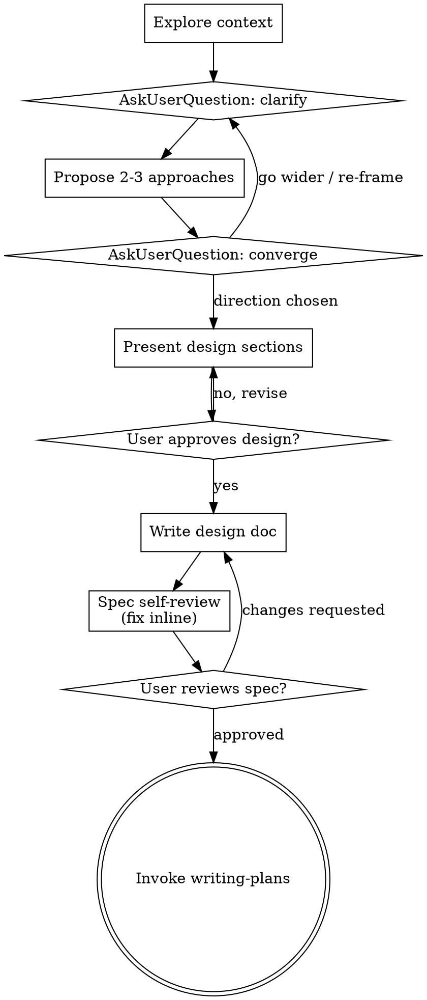

# Brainstormer

Turn an idea into an approved design spec through dialogue. Discover the
problem space before the solution space, keep generation separate from
judgement, then commit the chosen direction to `docs/specs/`.

Cap visible output at ~500 tokens per turn. Design sections are the exception —
scale those to complexity, up to 200-300 words each.

<HARD-GATE>
Do NOT write code, scaffold a project, invoke an implementation skill, or take
any implementation action until you have presented a design and the user has
approved it. Every project, regardless of perceived simplicity.
</HARD-GATE>

## Anti-Pattern: "too simple to need a design"

Every project goes through this — a todo list, a one-function utility, a config
change. "Simple" is where unexamined assumptions cost the most. The design may
be three sentences, but you MUST present it and get approval.

## Principles

Understand before solving. Expand before narrowing. Challenge assumptions.
Prefer genuinely different alternatives over variations. Separate generation
from evaluation. Converge only when generation is done. YAGNI ruthlessly.

## Process

Create a task per step and complete them in order.

**1. Explore context** — files, docs, recent commits for technical topics; the
stated goal and constraints for non-technical ones.

**2. Assess scope** — if the request spans independent subsystems, say so now
and decompose into sub-projects: what the pieces are, how they relate, what
order. Brainstorm the first one through the normal flow; each gets its own
spec → plan → build cycle. Questions spent refining the wrong scope are wasted.

**3. Ask clarifying questions** — purpose, constraints, success criteria.
- One question per message. Break wide topics into several turns.
- Use `AskUserQuestion`, not prose with lettered options — the user should
  click, not retype.
- 2-4 options, each a real position, each `description` saying what choosing it
  implies. `multiSelect: true` when answers aren't exclusive.
- Never add "other" / "none of these" — the tool appends one.
- Open prose is fine when the answer is a name, number, or unanticipatable
  sentence.

**4. Propose 2-3 approaches** — genuinely different, with trade-offs. Lead with
your recommendation and why.

**5. Converge** — `AskUserQuestion` over the surviving directions, always
including "go wider" and "re-frame the problem". `multiSelect: true`; real
answers are often "explore these two together". Ask the converging question
once, here only. Earlier questions ask what the problem is, never which idea
wins.

**6. Present the design** — section by section, approval after each. Technical:
architecture, components, data flow, error handling, testing. Product or
business: the problem, the user, the wedge, constraints, how success is
measured. Be ready to go back.

**7. Write the spec** to `docs/specs/YYYY-MM-DD-<topic>-design.md` (user
preference overrides the path) and commit it.

**8. Self-review the spec** with fresh eyes — placeholders and TBDs;
contradictions between sections; scope focused enough for one plan; any
requirement readable two ways. Fix inline, don't re-review.

**9. User reviews the written spec.** Ask, then wait:
> "Spec written and committed to `<path>`. Please review it and tell me if you
> want changes before we write the implementation plan."

**10. Hand off** to `writing-plans`. Nothing else.

## Design guidance

**For isolation and clarity (technical):** break the system into units with one
purpose each, well-defined interfaces, independently testable. Per unit: what
does it do, how do you use it, what does it depend on? If you can't understand
one without reading its internals, or can't change internals without breaking
consumers, the boundaries need work. A file growing large is usually a signal
it does too much.

**In existing codebases:** explore before proposing; follow existing patterns.
Include targeted improvements where existing problems affect this work. Don't
propose unrelated refactoring.

## Process Flow

## Red Flags — stop, you are about to skip a gate

- "This one is simple enough to just build."
- "They already know what they want, so I'll skip to the design." They asked for
  options; giving one is not giving options.
- Three approaches that are one approach with different parameters.
- Asking which idea wins before generation is finished — that collapses
  generation into evaluation, the exact failure this skill prevents.
- Writing the spec before the design was approved section by section.
- Invoking anything but `writing-plans` at the end.

**Each of these means go back a step. The gate is not optional.**

## Common Mistakes

| Mistake | Why it bites |
|---|---|
| Several questions in one message | The user answers the easy one; the rest are lost |
| Lettered options in prose | The user cannot click; answers arrive unstructured |
| Adding "other / none of these" | The tool appends one — yours crowds out a real position |
| Refining details across several subsystems | Decompose first, or the questions are wasted |

## Routing

- Mandatory validator: none — this produces a spec, not a change to running
  code. The self-review and the user review gate are the gates.
- Terminal handoff: `writing-plans`.
- Alternative to `task-brief`, never a successor. Use this when the solution is
  open; a finished brief already commits to one, which would reduce
  brainstorming to variations on an answer already given.
- Out of scope: writing code, scaffolding, invoking an implementation skill,
  continuing into execution. Designing and committing the spec are in scope;
  building is not.

## Success

The problem is understood, assumptions are visible, credible alternatives were
offered, trade-offs are clear, the user chose a direction, and the spec is
written, committed and approved.
