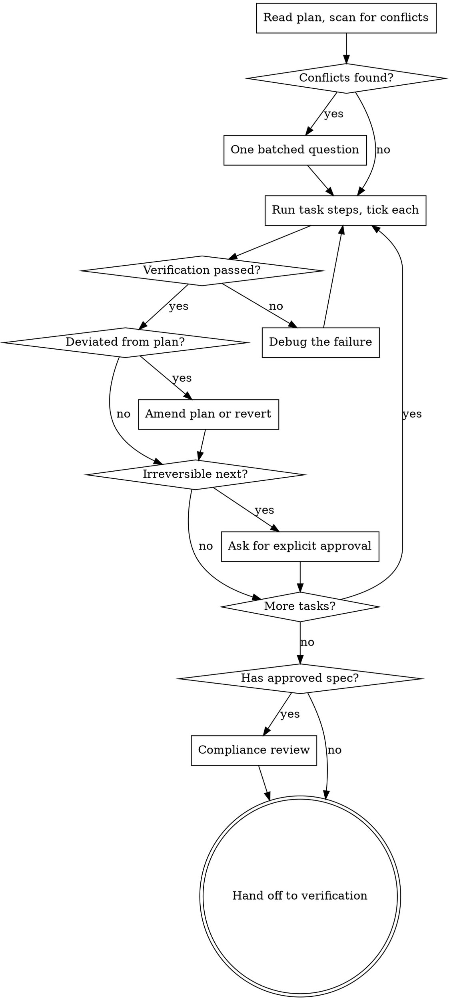

# Executing Plans

Implementation starts only in an isolated line of work — a branch, worktree, or
equivalent — kept separate from whatever ships. Follow the project's isolation
convention if it has one; if not, create a dedicated branch before task 1 and
record its name and base commit.

Carry out an approved plan and produce the thing it describes. Runs after a
plan is approved and before its result is verified — not instead of either.

Cap visible output at ~500 tokens. One line per task boundary; the plan file
and the tool results carry the record.

<HARD-GATE>
NEVER tick a step, or say a task is done, on a verification you did not run and
cannot quote.

Exit 0 is not proof the effect occurred. Read the result back: query the setting
you changed, count the rows, call the tool you registered, fire the hook you
edited. The recurring failure in agent-written work is *prose declaring a
capability the wiring does not implement*, and every instance of it was a step
marked complete on a command that returned successfully.
</HARD-GATE>

## Before Task 1: read the plan and argue with it

Read the whole plan once. Then scan for what would break execution:

- tasks that contradict each other or the plan's Constraints
- a task depending on something no earlier task produces
- a step whose verification cannot fail — it proves nothing
- anything the plan mandates that a reviewer would call a defect

Present everything you find **as one batched question**, each finding beside
the plan text that mandates it, asking which governs. One interrupt before
execution, not one per discovery mid-run. If the scan is clean, say nothing and
start.

The planning step self-reviews for this class, but that happens before
approval — the plan may have been edited since, and you are the last reader
before it becomes real.

## The progress record is the plan file

Tick `- [ ]` → `- [x]` as each step lands. That checkbox syntax is what tracks
progress; if the project snapshots the tree automatically after each turn (a
checkpoint script, a CI artifact), it reads this file too.

**Do not create a ledger file.** The need is real — context resets lose your
place — but the plan file and version control are already durable state, plus
a project-level handoff document if the project keeps one. Adding a fourth
owner creates exactly the duplicate state that has to be deleted again later.
After a reset, trust the plan file's checkboxes and the commit history over
your own recollection.

## The task loop

Per task, in order:

1. Read the task's **Files**, **Implementation notes** and **Verification**
   before touching anything. The plan already names the symbols and the command.
2. Write the failing test first when the task changes behaviour — see
   `references/test-driven-development.md`.
3. Make the change, limited to the files the task names. A file the plan did not
   name is scope escape, not initiative.
4. Run the task's own **Run:** command and compare against its **Expect:**.
5. Tick the checkbox in the plan file, then report **one line** and move on.

Do not pause for approval between tasks — a task in a well-formed plan already
ends with an independently testable deliverable, which is where the seam
belongs. Mid-task check-ins have no artefact to show.

Four things stop the loop:

| Stop | Do |
|---|---|
| A verification fails, or fails repeatedly | Start debugging deliberately. Not guessing, not asking — the failure is what triggers it |
| The plan is wrong, or silent where it matters | Ask, with the plan text beside the problem |
| You deviated from the plan | Reconcile — see below |
| The next step pushes, merges, publishes or deploys | Stop and get explicit approval in the conversation. No automated step can grant it |

## Deviation must be reconciled, never left implicit

If implementation diverges from what the plan says — a better structure, a
constraint the plan missed, a local convention that contradicts it — you must
either **amend the plan file with the reason**, or **revert to the plan**.

Never leave an unreconciled divergence for the reviewer to find. A convention
comment in one file is a claim about a local choice, not evidence of a global
rule; grep for counter-examples before letting it override the plan.

## Committing costs a review

A plan whose every task ends in "commit" needs a review sign-off per task,
because each commit delivers content nobody has looked at yet. Say which you
are doing before Task 1:

1. **Commit per task** — sign off each through review. Correct, and the
   history is clean.
2. **Execute the run, commit once** — one review over the whole change. Cheaper,
   and the plan's per-task commit steps get ticked as batched.

Choose deliberately. Nothing enforces this choice automatically, so decide and
say it up front — otherwise batching becomes the default without anyone having
actually decided it.

## Open-ended work: the loop mode

For work with no fixed task list — an experiment programme, a research
direction — the plan is a direction and the shape is two loops, not a line:

- **Inner loop:** pick the highest-priority untested hypothesis → write the
  protocol and what it predicts → **commit the protocol before running it** →
  run → sanity-check before trusting the number → record the outcome.
- **Outer loop**, every 5-10 inner passes or when a pattern appears: review the
  results together, ask *why*, update the findings document, then decide
  direction — **DEEPEN** (follow-up questions), **BROADEN** (adjacent untested
  questions), **PIVOT** (an assumption broke), or **CONCLUDE** (the evidence
  supports a contribution).

Locking the protocol before the run is what separates confirmatory from
exploratory: version-control history proves the plan predated the result.
Label results accordingly. A refuted hypothesis is progress — record what it
rules out.

State the termination criterion before starting. A loop without one does not
terminate.

## Dispatching subagents for parallel tasks

Only when parallel dispatch was explicitly chosen for this run — that choice is
the ask; do not spawn agents otherwise. One **`task-implementer`** per task,
dispatched concurrently within a round.

Compute the schedule rather than guessing at it. Group tasks by their declared
file dependencies: two tasks share a round only if their file sets are disjoint
and neither depends on the other. Tasks touching a migration, a lockfile, or
shared configuration get a round to themselves. If the project provides a
scheduling script, use its answer over intuition — treat a non-zero exit as the
plan not being schedulable, not something to route around. If it doesn't,
compute rounds by hand from the same rule.

Dispatch one implementation agent per task, every agent in a round together in
the same message. Give each: the path to its task's text (never pasted —
anything pasted into a dispatch stays in your context for the rest of the
session), the interfaces earlier rounds produced, the plan's constraints, and a
place to report back to.

Read what each agent reports rather than trusting that it succeeded. Expect
something like *done*, *done with concerns*, *needs more context*, or
*blocked*, and resolve each non-clean result deliberately — a blocked agent
gets escalated or reassigned once, never re-dispatched unchanged and never
left silently blocking the round.

Verify the round before dispatching the next: its tasks are independent of each
other by construction, but the next round depends on all of them finishing
correctly — an agent reporting success is not evidence; the diff is. Read
`references/parallel-dispatch.md` before the first fan-out, if the skill bundles
one — it should carry the full preconditions and recovery ladder.

## Environment gotchas that bite during execution

- **Toolchain and locale mismatches surface as fake failures.** A script that
  prints non-ASCII output can raise an encoding error on a default Windows
  console — that looks like the change failed, not like an environment
  mismatch. Set whatever encoding or locale flag the toolchain needs before
  running scripts.
- **A misconfigured hook, listener, or scheduled job fails silently** — its
  symptom is indistinguishable from "no problem." After editing one, trigger it
  directly against a realistic input; a clean diff is not evidence that it
  fires correctly.

## Red Flags — you are not executing, you are improvising

- "The command exited 0, so it worked."
- "I'll note the deviation in the summary at the end."
- "This step's verification is obvious, I'll skip running it."
- "The plan says commit here but I'll batch it and mention it later." Say it
  first, not after.
- "I'll fix the failing test myself, quickly." That's a debugging problem, not
  something to patch in place mid-task.
- "They'd obviously approve this push."
- Ticking a checkbox for a step you did not run.

**Each of these means: stop, run the thing, and quote what it printed.**

## Common Mistakes

| Mistake | Why it bites |
|---|---|
| Pausing between every task for approval | The plan was the approval; check-ins with no artefact waste the turn |
| Creating a progress ledger file | Another owner of state; the plan's checkboxes already are one |
| Guessing at a failing verification | The failure should trigger dedicated debugging, and the cause belongs wherever the project tracks issues |
| Deviating silently | The reviewer finds it instead, and the review round is wasted |
| Pasting task text into a subagent prompt | Resident in your context for the rest of the session; hand over a path |
| Running an open-ended loop with no termination criterion | It does not terminate |

## Process Flow

Before the terminal handoff, dispatch a compliance review when the
implementation has an approved spec or material acceptance criteria — it
checks compliance but does not fix or approve the work. Then hand off to
verification.

## Techniques — read one when the task calls for it

Separate references until now. Each cost context on every turn for depth that
applies to some tasks, not all. Same content, loaded on demand.

| The task involves | Read |
|---|---|
| new or changed behaviour that needs executable proof | `references/test-driven-development.md` |
| multi-file, parallel or risky work that must not touch the checkout | `references/using-git-worktrees.md` |
| more than one agent to dispatch, or one that came back blocked | `references/parallel-dispatch.md` |

Isolation is a decision made **before** the first edit, not after the diff
grows.

## Next step — you MUST take it

**The terminal state is invoking `verifying-work`**, once every task is
ticked. Every task green is not the same as the goal met, and this skill
cannot judge its own output. Do not announce completion before verification
has run.

## Routing

- Mandatory validator: verification of the completed work. Every task green is
  not the same as the goal met, and this skill cannot judge its own output.
- Independent compliance lens: dispatch `spec-reviewer` for material approved
  specs or acceptance criteria. It checks compliance; it does not fix or approve.
- Preceded by planning, which produces the plan this consumes.
- Terminal handoff: `verifying-work`, then `delivering`.
- A failure worth remembering goes wherever the project tracks issues; the unit
  of work goes wherever the project records decisions or session history, if it
  keeps one.
- Before anything irreversible, stop and ask in the conversation.

## Success

The plan's checkboxes are ticked only where a verification was run and quoted,
every deviation is written into the plan file with its reason, and the reason
each stop happened is visible — not discovered later by a reviewer.