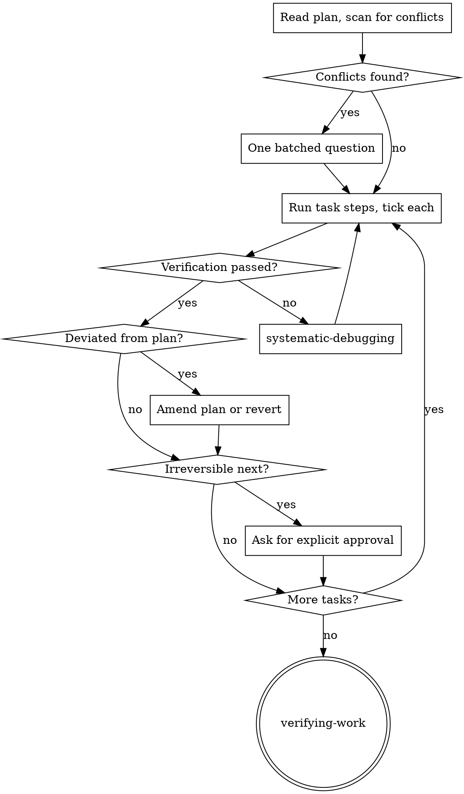

# Executing Plans

Carry out an approved plan and produce the thing it describes. Workflow stage 4.

Cap visible output at ~500 tokens. One line per task boundary; the plan file
and the tool results carry the record.

<HARD-GATE>
NEVER tick a step, or say a task is done, on a verification you did not run and
cannot quote.

Exit 0 is not proof the effect occurred. Read the result back: query the setting
you changed, count the rows, call the tool you registered, fire the hook you
edited. This repo's recurring failure is *prose declaring a capability the
wiring does not implement* — seven instances — and every one of them was a step
marked complete on a command that returned successfully.
</HARD-GATE>

## Before Task 1: read the plan and argue with it

Read the whole plan once. Then scan for what would break execution:

- tasks that contradict each other or the plan's Global Constraints
- a task depending on something no earlier task produces
- a step whose verification cannot fail — it proves nothing
- anything the plan mandates that `code-review` would call a defect

Present everything you find **as one batched question**, each finding beside
the plan text that mandates it, asking which governs. One interrupt before
execution, not one per discovery mid-run. If the scan is clean, say nothing and
start.

`writing-plans` self-reviews for this class, but that runs before approval —
the plan may have been edited since, and you are the last reader before it
becomes real.

## The progress record is the plan file

Tick `- [ ]` → `- [x]` as each step lands. `writing-plans` mandates that syntax
expressly for tracking, and `post-run/03-checkpoint.py` snapshots the tree every
turn.

**Do not create a ledger file.** The need is real — context resets lose your
place — but this repo already has three owners of durable state (the plan,
`HANDOFF.md`, the checkpoint), and adding a fourth creates exactly the duplicate
owner this repo keeps having to delete. After a reset, trust the plan file's
checkboxes and `git log` over your own recollection.

## The task loop

Per task: run its steps in order, tick each, then report **one line** and move
on. Do not pause for approval between tasks — a task in a `writing-plans` plan
already ends with an independently testable deliverable, which is where the
seam belongs. Mid-task check-ins have no artefact to show.

Four things stop the loop:

| Stop | Do |
|---|---|
| A verification fails, or fails repeatedly | `systematic-debugging`. Not guessing, not asking — the failure is its trigger |
| The plan is wrong, or silent where it matters | Ask, with the plan text beside the problem |
| You deviated from the plan | Reconcile — see below |
| The next step pushes, merges, publishes or deploys | Stop and get explicit approval in the conversation. No skill can grant it |

## Deviation must be reconciled, never left implicit

If implementation diverges from what the plan says — a better structure, a
constraint the plan missed, a local convention that contradicts it — you must
either **amend the plan file with the reason**, or **revert to the plan**.

Never leave an unreconciled divergence for the reviewer to find. A convention
comment in one file is a claim about a local choice, not evidence of a global
rule; grep for counter-examples before letting it override the plan.

## Committing costs a review

A plan whose every task ends in "commit" needs a `code-review` sign-off per task,
because each commit delivers content nobody has looked at yet. Say which you are
doing before Task 1:

1. **Commit per task** — sign off each through `code-review`. Correct, and the
   history is clean.
2. **Execute the run, commit once** — one review over the whole change. Cheaper,
   and the plan's per-task commit steps get ticked as batched.

Choose deliberately. Until 2026-08-02 `pre-commit/03-review-gate.py` forced the
question by interrupting every commit; it was deleted, so nothing asks now and
option 2 is what happens by default if you say nothing.

## Open-ended work: the loop mode

For work with no fixed task list — an experiment programme, a research
direction — the plan is a direction and the shape is two loops, not a line:

- **Inner loop:** pick the highest-priority untested hypothesis → write the
  protocol and what it predicts → **commit the protocol before running it** →
  run → sanity-check before trusting the number → record the outcome.
- **Outer loop**, every 5-10 inner passes or when a pattern appears: review the
  results together, ask *why*, update the findings document, then decide
  direction — **DEEPEN** (follow-up questions), **BROADEN** (adjacent untested
  questions), **PIVOT** (an assumption broke), or **CONCLUDE** (the evidence
  supports a contribution).

Locking the protocol before the run is what separates confirmatory from
exploratory: git history proves the plan predated the result. Label results
accordingly. A refuted hypothesis is progress — record what it rules out.

State the termination criterion before starting. A loop without one does not
terminate.

## Subagent execution

Only when the user chose it at `writing-plans` gate 3 — that choice is the ask;
do not spawn agents otherwise. Then: one agent per task, never two in parallel,
each given its task's text as a **file path** rather than pasted, plus the
interfaces from earlier tasks and nothing else. Everything pasted into a
dispatch stays in your context for the rest of the session. Review each task
before dispatching the next.

## Repo gotchas that bite during execution

- **`PYTHONIOENCODING=utf-8` before any tool script.** Several print `→` and
  `—`; the Windows console default raises `UnicodeEncodeError` and turns a
  passing run into a fake failure.
- **A hook bug's symptom is silence**, identical to "no problem". After editing
  any hook, fire it with `tools/run_hook.py` against a realistic payload. Do not
  count a hook edit as done on a clean diff.

## Red Flags — you are not executing, you are improvising

- "The command exited 0, so it worked."
- "I'll note the deviation in the summary at the end."
- "This step's verification is obvious, I'll skip running it."
- "The plan says commit here but I'll batch it and mention it later." Say it
  first, not after.
- "I'll fix the failing test myself, quickly." That is `systematic-debugging`.
- "They'd obviously approve this push."
- Ticking a checkbox for a step you did not run.

**Each of these means: stop, run the thing, and quote what it printed.**

## Common Mistakes

| Mistake | Why it bites |
|---|---|
| Pausing between every task for approval | The plan was the approval; check-ins with no artefact waste the turn |
| Creating a progress ledger file | Fourth owner of state; the plan's checkboxes already are one |
| Guessing at a failing verification | The failure is `systematic-debugging`'s trigger and it writes `ISSUES.md` |
| Deviating silently | The reviewer finds it instead, and the review round is wasted |
| Pasting task text into a subagent prompt | Resident in your context for the rest of the session; hand over a path |
| Running an open-ended loop with no termination criterion | It does not terminate |

## Process Flow

## Next step — you MUST take it

**The terminal state is invoking `verifying-work`**, once every task is ticked.
Every task green is not the same as the goal met, and this skill cannot judge
its own output. Do not announce completion before that skill has run.

## Parallel work — `task-implementer`

Subagent mode dispatches one **`task-implementer`** per task. **Never two at
once** — plan tasks touch overlapping files far more often than they appear to,
and two implementers editing the same file is a conflict you caused. Parallelism
here is across *reviews*, not implementations: while one task is under review,
the next may be dispatched.

Give each: the path to its task text (never the whole plan, never pasted), the
interfaces earlier tasks produced, the global constraints, and a report path.
Read its status — `DONE`, `DONE_WITH_CONCERNS`, `NEEDS_CONTEXT`, `BLOCKED` —
and never let a `BLOCKED` retry unchanged on the same model.

Verify each task before dispatching the next. An agent reporting success is not
evidence; the diff is.

## Routing

- Mandatory validator: `verifying-work`. Every task green is not the same as the
  goal met, and this skill cannot judge its own output.
- Preceded by `writing-plans`, which produces the plan this consumes.
- Terminal handoff: `verifying-work`, then `delivering`.
- A failure worth remembering goes to `ISSUES.md` via `systematic-debugging`; the
  unit of work goes to `LOG.md` via `knowledge-manager`.
- Before anything irreversible, stop and ask in the conversation.

## Success

The plan's checkboxes are ticked only where a verification was run and quoted,
every deviation is written into the plan file with its reason, and the reason
each stop happened is visible — not discovered later by a reviewer.
