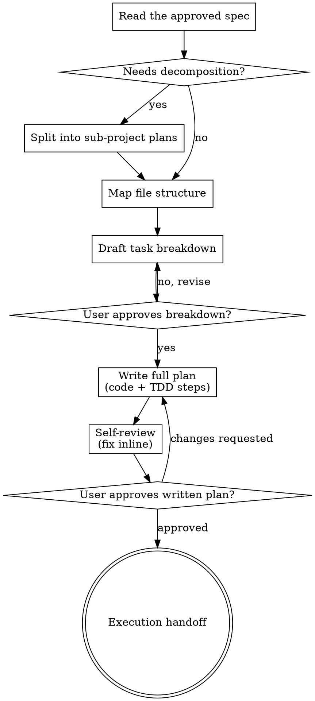

# Writing Plans

Write the plan assuming the engineer has zero context for this codebase and
questionable taste: which files to touch per task, the code, the tests, how to
run them. Bite-sized tasks. DRY. YAGNI. TDD. Frequent commits. Assume a skilled
developer who knows almost nothing about our toolset or problem domain, and
does not know good test design well.

**Announce at start:** "I'm using the writing-plans skill to create the
implementation plan."

**Save to** `docs/plans/YYYY-MM-DD-<feature-name>.md` (user preference
overrides).

<HARD-GATE>
Do NOT write implementation code, scaffold, or invoke an implementation skill.
This skill produces a plan document and stops at the execution handoff.
</HARD-GATE>

## Output

`docs/plans/YYYY-MM-DD-<feature>.md` — the task-by-task script a fresh engineer
or subagent executes, with real code and real test commands.

`PLAN.md` at the repo root is a different artefact: ordering, dependencies,
risks and acceptance criteria across a whole effort. No skill owns it. If that
strategic layer is wanted, build it as its own skill rather than widening this
one — merging them produces a document that does neither well.

## Asking questions

Where the spec is silent and the answer changes the plan, ask — one question per
message, `AskUserQuestion` with concrete options rather than an open prompt.
Don't ask what the spec already answers; re-read it first.

## Three blocking gates

Each is an `AskUserQuestion`. Never proceed past one on inference.

**Gate 1 — decomposition.** If the spec covers multiple independent subsystems
it should have been split during brainstorming. If it wasn't, propose one plan
per subsystem, each producing working testable software on its own. Offer:
proceed as one plan, or split into the named sub-projects.

**Gate 2 — task breakdown.** Present titles plus one-line deliverables, no code
yet. Offer: approve, re-cut the boundaries, or change the order. Writing task
bodies before boundaries are agreed wastes the most expensive part of the plan.

**Gate 3 — execution handoff.** After saving the plan:
> "Plan complete and saved to `docs/plans/<filename>.md`. Two execution options:"
> 1. **Subagent-driven (recommended)** — a fresh `general-purpose` agent per task
>    via the Agent tool, review between tasks. Requires disjoint files per task
>    and frozen interfaces, per each task's **Interfaces** block.
> 2. **Inline execution** — run tasks in this session, batching with checkpoints.

Wait for the choice.

## Before defining tasks: map the files

Which files get created or modified, and what each is responsible for. This is
where decomposition gets locked in.

- One clear responsibility per file; clear boundaries, well-defined interfaces.
- Prefer smaller focused files — you reason best about code you can hold in
  context at once, and edits are more reliable.
- Files that change together live together. Split by responsibility, not by
  technical layer.
- Follow established patterns in existing codebases. Don't unilaterally
  restructure, but if a file you're modifying has grown unwieldy, planning a
  split is reasonable.

## Task right-sizing

A task is the smallest unit that carries its own test cycle and is worth a fresh
reviewer's gate. Fold setup, configuration, scaffolding and documentation into
the task whose deliverable needs them; split only where a reviewer could
meaningfully reject one task while approving its neighbour. Each task ends with
an independently testable deliverable.

Each **step** is one action, 2-5 minutes: write the failing test / run it and see
it fail / implement minimally / run it and see it pass / commit.

## Plan document header

Every plan MUST start with this:

```markdown
# [Feature Name] Implementation Plan

> **For agentic workers:** implement this plan task-by-task. Steps use
> checkbox (`- [ ]`) syntax for tracking.

**Goal:** [One sentence describing what this builds]

**Architecture:** [2-3 sentences about approach]

**Tech Stack:** [Key technologies/libraries]

## Global Constraints

[The spec's project-wide requirements — version floors, dependency limits,
naming and copy rules, platform requirements — one line each, values copied
verbatim from the spec. Every task implicitly includes this section.]

---
```

## Task structure

````markdown
### Task N: [Component Name]

**Files:**
- Create: `exact/path/to/file.py`
- Modify: `exact/path/to/existing.py:123-145`
- Test: `tests/exact/path/to/test.py`

**Interfaces:**
- Consumes: [what this uses from earlier tasks — exact signatures]
- Produces: [what later tasks rely on — exact names, parameter and return
  types. An implementer sees only their own task; this block is how they learn
  the names neighbouring tasks use.]

- [ ] **Step 1: Write the failing test**

```python
def test_specific_behavior():
    result = function(input)
    assert result == expected
```

- [ ] **Step 2: Run test to verify it fails**

Run: `pytest tests/path/test.py::test_name -v`
Expected: FAIL with "function not defined"

- [ ] **Step 3: Write minimal implementation**

```python
def function(input):
    return expected
```

- [ ] **Step 4: Run test to verify it passes**

Run: `pytest tests/path/test.py::test_name -v`
Expected: PASS

- [ ] **Step 5: Commit**

```bash
git add tests/path/test.py src/path/file.py
git commit -m "feat: add specific feature"
```
````

## Self-review

After writing the complete plan, check it against the spec with fresh eyes.
Yourself, not a subagent.

1. **Spec coverage** — skim each spec requirement. Can you point to a task that
   implements it? Add tasks for any gaps.
2. **Placeholder scan** — hunt the Red Flags below and fix them.
3. **Type consistency** — do types, signatures and property names in later tasks
   match what earlier tasks defined? `clearLayers()` in Task 3 but
   `clearFullLayers()` in Task 7 is a bug.

Fix inline; no need to re-review.

## Red Flags — the plan is not finished

- "TBD", "TODO", "implement later", "fill in details".
- "Add appropriate error handling" / "add validation" / "handle edge cases".
- "Write tests for the above" with no test body.
- "Similar to Task N" — repeat the code; tasks get read out of order.
- A step that says what to do without showing how. Code steps need code blocks.
- A reference to a type, function or method no task defines.
- "The spec implies it, so I don't need to state it." The implementer never sees
  the spec.
- "I'll write the task bodies first and get boundaries approved after."

**Each of these turns the handoff into a request that the implementer redo your
job.**

## Common Mistakes

| Mistake | Why it bites |
|---|---|
| Referring to a type or function no task defines | The implementer has only their own task; an undefined name is a dead end |
| Renaming across tasks (`clearLayers` → `clearFullLayers`) | Silent integration bug the self-review exists to catch |
| Skipping a gate on inference | All three block; "they'd obviously approve" is not an approval |
| Widening this into `PLAN.md` territory | Ordering and risk across an effort is a different artefact — see Output |

## Process Flow



## Routing

- Mandatory validator: none — this produces a plan document, not a change to
  running code. The self-review and the three gates are the gates.
- Preceded by `brainstormer`, which produces the spec this consumes.
- Terminal handoff: the execution path chosen at gate 3.
- Before any task that pushes, merges, deploys or is otherwise irreversible,
  stop and get explicit approval in the conversation. There is no approval
  skill — the plan names the step and you ask.
