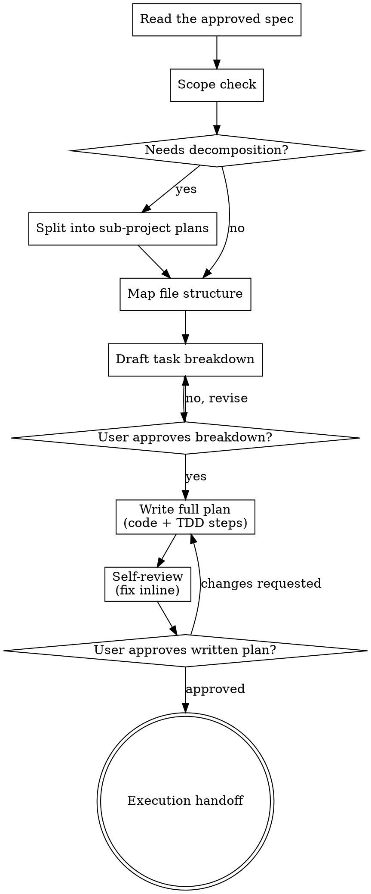

# Writing Plans

## Overview

Write comprehensive implementation plans assuming the engineer has zero context
for this codebase and questionable taste. Document everything they need: which
files to touch for each task, the code, the testing, docs they might need to
check, how to test it. Give them the whole plan as bite-sized tasks. DRY.
YAGNI. TDD. Frequent commits.

Assume a skilled developer who knows almost nothing about our toolset or
problem domain, and does not know good test design well.

**Announce at start:** "I'm using the writing-plans skill to create the
implementation plan."

**Save plans to:** `docs/plans/YYYY-MM-DD-<feature-name>.md`
(user preferences for plan location override this default)

<HARD-GATE>
Do NOT write implementation code, scaffold, or invoke an implementation skill
from here. This skill produces a plan document and stops at the execution
handoff.
</HARD-GATE>

---

## Relationship to execution-planner

These produce different artefacts and neither replaces the other:

- `execution-planner` → `PLAN.md`. Ordering, dependencies, parallelism, risks
  and acceptance criteria across the whole effort. Strategic.
- `writing-plans` → `docs/plans/YYYY-MM-DD-<feature>.md`. The task-by-task
  script a fresh engineer or subagent executes, with real code and real test
  commands. Tactical.

If both are wanted, `execution-planner` runs first and its ordering constrains
the task sequence here.

---

## Asking Questions

Where the spec is silent and the answer changes the plan, ask — but:

- **One question per message.** If a topic needs more exploration, break it
  into several questions asked in turn.
- **Prefer multiple choice.** Use `AskUserQuestion` with concrete options
  rather than an open prompt; open-ended is a fallback, not the default.
- Do not ask what the spec already answers. Re-read it first.

---

## Process Flow



**Three approval gates, all blocking:** decomposition, task breakdown, written
plan. Each is an `AskUserQuestion` with multiple-choice options. Do not proceed
past a gate on inference.

---

## Scope Check

If the spec covers multiple independent subsystems, it should have been broken
into sub-project specs during brainstorming. If it wasn't, suggest breaking
this into separate plans — one per subsystem. Each plan should produce working,
testable software on its own.

**Gate 1** — present the proposed split via `AskUserQuestion`: proceed as one
plan, or split into the named sub-projects.

---

## File Structure

Before defining tasks, map out which files will be created or modified and what
each is responsible for. This is where decomposition decisions get locked in.

- Design units with clear boundaries and well-defined interfaces. One clear
  responsibility per file.
- You reason best about code you can hold in context at once, and edits are
  more reliable when files are focused. Prefer smaller, focused files.
- Files that change together live together. Split by responsibility, not by
  technical layer.
- In existing codebases, follow established patterns. Don't unilaterally
  restructure — but if a file you're modifying has grown unwieldy, including a
  split in the plan is reasonable.

---

## Task Right-Sizing

A task is the smallest unit that carries its own test cycle and is worth a
fresh reviewer's gate. Fold setup, configuration, scaffolding and documentation
into the task whose deliverable needs them; split only where a reviewer could
meaningfully reject one task while approving its neighbour. Each task ends with
an independently testable deliverable.

**Gate 2** — present the task list (titles + one-line deliverables, no code
yet) via `AskUserQuestion`: approve, re-cut the boundaries, or change the
order. Writing full task bodies before the boundaries are agreed wastes the
most expensive part of the plan.

---

## Bite-Sized Task Granularity

**Each step is one action (2-5 minutes):**

- "Write the failing test" — step
- "Run it to make sure it fails" — step
- "Implement the minimal code to make the test pass" — step
- "Run the tests and make sure they pass" — step
- "Commit" — step

---

## Plan Document Header

**Every plan MUST start with this header:**

```markdown
# [Feature Name] Implementation Plan

> **For agentic workers:** implement this plan task-by-task. Steps use
> checkbox (`- [ ]`) syntax for tracking.

**Goal:** [One sentence describing what this builds]

**Architecture:** [2-3 sentences about approach]

**Tech Stack:** [Key technologies/libraries]

## Global Constraints

[The spec's project-wide requirements — version floors, dependency limits,
naming and copy rules, platform requirements — one line each, with exact
values copied verbatim from the spec. Every task's requirements implicitly
include this section.]

---
```

---

## Task Structure

````markdown
### Task N: [Component Name]

**Files:**
- Create: `exact/path/to/file.py`
- Modify: `exact/path/to/existing.py:123-145`
- Test: `tests/exact/path/to/test.py`

**Interfaces:**
- Consumes: [what this task uses from earlier tasks — exact signatures]
- Produces: [what later tasks rely on — exact function names, parameter and
  return types. A task's implementer sees only their own task; this block is
  how they learn the names and types neighbouring tasks use.]

- [ ] **Step 1: Write the failing test**

```python
def test_specific_behavior():
    result = function(input)
    assert result == expected
```

- [ ] **Step 2: Run test to verify it fails**

Run: `pytest tests/path/test.py::test_name -v`
Expected: FAIL with "function not defined"

- [ ] **Step 3: Write minimal implementation**

```python
def function(input):
    return expected
```

- [ ] **Step 4: Run test to verify it passes**

Run: `pytest tests/path/test.py::test_name -v`
Expected: PASS

- [ ] **Step 5: Commit**

```bash
git add tests/path/test.py src/path/file.py
git commit -m "feat: add specific feature"
```
````

---

## No Placeholders

Every step must contain the actual content an engineer needs. These are **plan
failures** — never write them:

- "TBD", "TODO", "implement later", "fill in details"
- "Add appropriate error handling" / "add validation" / "handle edge cases"
- "Write tests for the above" (without actual test code)
- "Similar to Task N" (repeat the code — the engineer may read tasks out of
  order)
- Steps that describe what to do without showing how (code blocks required for
  code steps)
- References to types, functions or methods not defined in any task

---

## Self-Review

After writing the complete plan, look at the spec with fresh eyes and check the
plan against it. A checklist you run yourself — not a subagent dispatch.

1. **Spec coverage** — skim each section/requirement in the spec. Can you point
   to a task that implements it? List any gaps.
2. **Placeholder scan** — search for the red flags above. Fix them.
3. **Type consistency** — do the types, signatures and property names used in
   later tasks match what earlier tasks defined? `clearLayers()` in Task 3 but
   `clearFullLayers()` in Task 7 is a bug.

Fix issues inline. No need to re-review — fix and move on. If a spec
requirement has no task, add the task.

---

## Execution Handoff

**Gate 3** — after saving the plan, present the execution choice via
`AskUserQuestion`:

> "Plan complete and saved to `docs/plans/<filename>.md`. Two execution
> options:"

1. **Subagent-driven (recommended)** — dispatch a fresh agent per task
   (`backend-engineer`, `frontend-engineer`, `ai-engineer`, `qa-engineer` as
   the task's files dictate), review between tasks, fast iteration. Requires
   disjoint files per task and a frozen interface, per each task's
   **Interfaces** block. Route non-obvious splits through `work-decomposition`.
2. **Inline execution** — run the tasks in this session under
   `workflow-orchestrator`, batching with checkpoints for review.

Wait for the choice. Do not pick one by inference.

---

## Routing

- Mandatory validator: none — this skill produces a plan document, not a change
  to running code. The self-review above is the gate.
- Preceded by: `brainstormer` (spec), optionally `execution-planner` (ordering)
- Terminal handoff: the chosen execution path above
- Route to `approval-brief` before any task in the plan does something
  irreversible.
